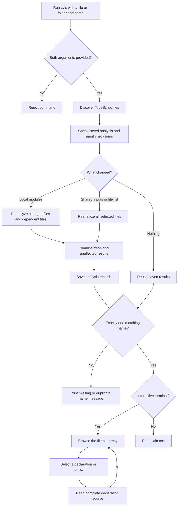

# cvis terminal explorer

## Purpose

`docs/prompt2.md` replaces the browser map with a TypeScript and Node.js terminal application. A user chooses a file or folder and a function or object name, browses incoming and outgoing connections, and opens complete declarations without changing the selected project.

## Engineering choices

Chai's Law of Good Coding #1, correctness, reliability, and security: use TypeScript's established parser and declaration resolution. Do not guess runtime targets. Expose unresolved calls and read failures. Never execute the inspected project. Escape source-controlled terminal commands before displaying text.

Chai's Law of Good Coding #2, maintainability: use Ink for the terminal interface. Separate discovery, analysis, hierarchy formatting, and interaction. Store simple declaration and connection records rather than compiler objects in the viewer.

Chai's Law of Good Coding #3, consistency: use TypeScript, npm, a committed lockfile, and Prettier. The browser app, server, browser workers, and graph layout dependencies have been removed.

## User flow

## Source loading decision

The agreed design is to read source directly from the original file when the user opens a declaration or connection. Assume files do not change while the user is browsing. Do not copy source files or retain a complete source snapshot at startup for later viewing, either in memory or under `~/.cvis/`.

Keep the file paths, declaration positions, and connection records needed for navigation. Load source text for the current view when needed and release it when that view closes. If a file cannot be read, show a clear error. File watching and automatic refresh are outside this design. Restart analysis after editing project files.

`Explorer` in `src/ui.tsx` calls `sourceRows` in `src/display.ts` to open source. That path reads the original file using the location and declaration positions recorded by `analyze` in `src/analyze.ts`. Startup analysis still needs to read code to discover declarations and connections. This decision removes source copies kept for viewing, but does not by itself reduce TypeScript's peak analysis memory.

This behavior is implemented. Source text is kept only for the open view, with no source copies written to disk.

## Code ownership and callers

`src/cli.tsx` parses arguments, calls `runAnalysis`, and chooses plain output or the interactive `Explorer`. Ink is loaded only for interactive output.

`src/run-analysis.ts` exposes `runAnalysis`, which starts `src/analysis-worker.ts`. The worker calls `cachedAnalysis` in `src/analysis-cache.ts` and sends the completed snapshot to the command. It has a 16 MiB call stack for long import chains and Node’s default memory allowance. Worker errors and early exits reject the command with a visible failure. This is not a total process memory cap.

`src/discover.ts` exposes `discover`, called by `analyze`. It collects supported files and enforces discovery exclusions and size limits.

`src/analyze.ts` exposes `analyze`. It groups selected files by their nearest configuration, creates TypeScript analysis contexts, extracts declarations, and records connections. The cached read function serves configuration and compiler reads. Calls are resolved from actual symbols, including import aliases and re-exports. Detected writes prevent treating reassigned bindings as dependable call targets.

`src/model.ts` defines the immutable snapshot passed to the display. The result contains no source text or saved-source directory. Declarations retain source spans, parent identities, and line numbers. Connections retain their first call location after duplicate removal.

`src/hierarchy.ts` exposes `fileHierarchy`, used by both output modes to display callers and callees around the requested declaration. `src/display.ts` provides shared row formatting and `sourceRows`, used by `Explorer` to read the original file on demand and slice the complete declaration. Read failures produce a visible message in the source view. `safeText` escapes terminal controls for both display and errors.

`src/ui.tsx` exposes `Explorer`. It owns selection, source scrolling, terminal resizing, and page history. It renders a window of the row list, and returning from source preserves the selected hierarchy row. Navigation never reruns analysis. Opening source reads the original project file. The current view keeps formatted source rows while scrolling and releases them when closed.

## Scope and uncertainty

Incoming callers are limited to the selected files. Files imported from outside the selection are external targets. Discovery includes `.ts`, `.tsx`, `.mts`, and `.cts`, excluding declaration-only files. It does not execute or build project references.

Every call, construction, and tagged template in selected source is visited. Calls inside callbacks belong to the callbacks. Initializers belong to File initialization. Cross-file object, class, and type references are separate from calls.

Conditional function aliases, dynamic properties, and missing targets remain unresolved. The tool does not claim runtime completeness. Declaration resolution is not full data-flow analysis, and runtime overrides or mutations can change actual behavior. There is no assertion that a missing arrow means unused code.

## Saved analysis and selective reanalysis

`cachedAnalysis` stores one binary result per selected path under `~/.cvis/analysis/`. Node's built-in serialization preserves maps and sets, and Zod validates the stored structure. A checksum detects damaged data. Writes use a private temporary directory and an atomic rename, so concurrent runs do not expose partly written results. The file is limited to 128 MiB and retained across runs. Deleting `~/.cvis/analysis/` clears saved results.

`AnalysisInputs` in `src/analysis-inputs.ts` records content checksums for files read by TypeScript, including configuration and dependency files outside the selection. It also records file sizes, successful and failed path lookups, directory lookups, and resolved symbolic links. Startup repeats discovery and validates those observations. Checksums inspect content rather than trusting modification dates. Changes to cvis's analysis code, TypeScript, Node, or the working directory invalidate saved results.

`affectedFiles` in `src/analysis-state.ts` follows recorded import dependencies backward through callers and re-exports, including cycles. When only selected module contents change, `analyze` refreshes declarations, connections, reference positions, and file warnings for the changed and dependent files. It keeps the other files' records. TypeScript still builds the needed project contexts and loads related code to resolve names correctly. This is selective extraction of analysis results, not a guarantee that TypeScript reads only changed files.

Changes to the selected file list, shared settings, dependency inputs, or resolution lookups cause a full rebuild. Global declarations, reference directives, and detected cross-file assignments also require a full rebuild when affected. A changed module that introduces such behavior is checked again with a full rebuild. If inputs change during analysis, results are shown with a warning but are not saved. Invalid or inaccessible saved data falls back to analysis with a visible warning.

The viewer reports how many files reused saved results. Original source is still read on demand when opened. No full source copies are stored.

## In-memory lifetime

Read results are shared between analysis contexts during a run. Once analysis returns, the viewer retains file paths, compact declarations and connections, reference positions, and the hierarchy. The analysis worker exits and releases its compiler contexts and read cache. Opening source reads the original file and creates the current view's line list on demand. Closing the view releases that list. No source copies are saved under `~/.cvis/`. Assume files stay unchanged while browsing, and restart analysis after edits.

## Packaging

The package exposes `dist/cli.js` as `cvis`. The build emits JavaScript and marks the command executable. `prepack` builds it for npm packaging. Local testing uses `npx --no-install cvis`. Public publication and npm name ownership are separate release steps, and neither has been performed.
