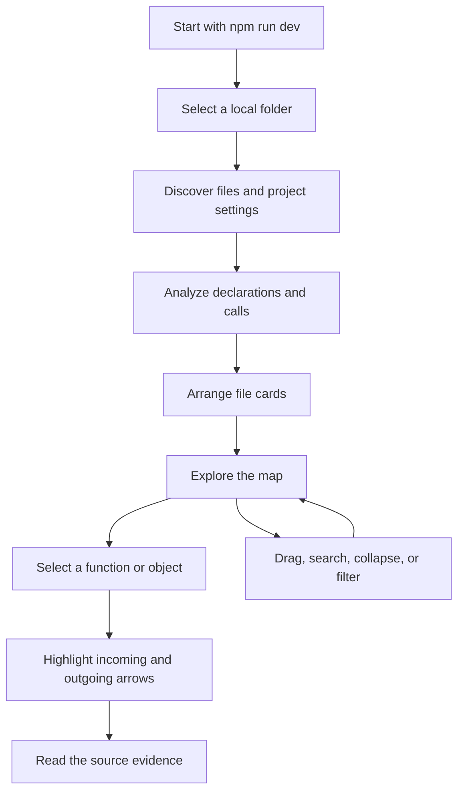
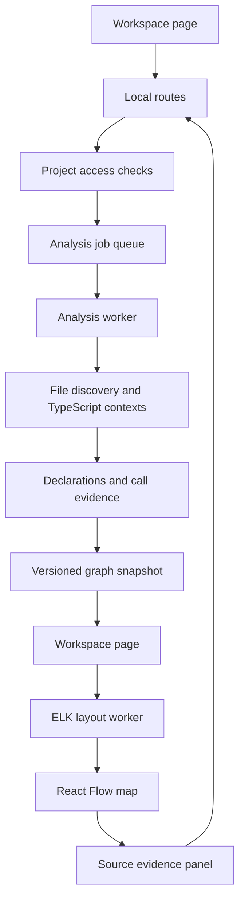

# Code Visualizer

## Status and purpose

The local application is implemented. This document preserves the intended design. See [validation results](../validation.md) for completed checks, measurements, and remaining browser-performance validation.

Reviewing code requires understanding how changes connect to the rest of an application. AI can change many files quickly, while the reviewer still has to reconstruct those connections by opening files one at a time.

Build a local Next.js application that starts with `npm run dev`. The user selects a folder and receives a draggable map of its files. Each file lists the functions and objects declared inside it, with arrows between the individual entries showing calls and possible call targets.

The first version understands TypeScript and JavaScript, including TSX and JSX. Other files remain discoverable in the folder list but carry an unsupported label and no inferred function connections. Supporting additional languages is a later project.

## Decisions and priorities

Chai's Law of Good Coding #1, correctness, reliability, and security: use TypeScript's own analysis, preserve evidence for every arrow, inspect every conditional branch, and make incomplete analysis visible. Read selected projects without executing their code or modifying their files.

Chai's Law of Good Coding #2, maintainability: use existing open source tools for the page, graph interaction, and layout. Keep code analysis separate from display and use one shared definition of files, declarations, and connections.

Chai's Law of Good Coding #3, consistency: use TypeScript throughout, the Next.js App Router, npm with a committed lockfile, and consistent formatting. Avoid adding an alternative web server or custom graph engine unless measured limitations justify it.

This phase delivers the folder map and call exploration. AI explanations, code editing, Git change review, runtime tracing, and cloud hosting are later features. The model should preserve source locations so change review can be added without rebuilding the analysis.

## User experience

1. Run `npm install`, then `npm run dev`, and open the displayed localhost address in Arc.
2. Click Select folder. Browse local folders in an application dialog, or paste an absolute folder path. Confirm the selected root in that dialog.
3. See discovery and analysis progress, file counts, warnings, and a Cancel action. Selecting another folder cancels the old job and prevents its results from replacing the new map.
4. See file cards grouped by folder. Each card has a relative path and expandable rows for functions, objects, classes, and their members.
5. Drag a file card to move it and all its contents. Function and object entries are independently draggable within their owning file. They can be pinned into an expanded detail area while retaining their file label. Moving an entry never changes source code.
6. Click a row to highlight incoming and outgoing arrows. Follow an arrow to its target, or inspect the exact source lines responsible for the connection in a read-only side panel.
7. Search by file or declaration name. Switch between all connections and a focused view, control how many steps to follow, and filter external or uncertain targets.
8. Collapse a file or object to simplify the map. Connections remain available and are grouped at its boundary with counts. Expanding restores the individual endpoints.
9. Click Refresh after source changes. Preserve surviving positions, pins, filters, and the selected declaration where possible. Show that the displayed map is a snapshot, with the last analysis time.

All files and declarations remain searchable even when not drawn at the current zoom. At overview zoom, show file names and connection counts. At closer zoom, reveal function and object rows and their individual arrows.

## What the map means

### Files and declarations

A file card represents one supported source file under the selected root. It includes files with no functions, which show an empty-state label rather than disappearing.

List named function declarations, functions assigned to variables, nested functions, named object values, classes, constructors, methods, and callable properties. Include function expressions and arrow functions. Anonymous functions receive a contextual label and source location, such as a callback passed to a particular call. Keep nested declarations under their owning declaration instead of flattening unrelated scopes together.

An object means a runtime value declared in the file, including an object literal or a named variable holding an object instance. Classes receive their own rows and member lists. Type aliases and interfaces can appear as clearly labeled type-only entries, but they do not execute calls. Imported values are linked to their declarations rather than presented as newly declared objects.

A plain object does not itself call functions. Calls in its property initializers belong to its initialization entry, while calls inside its methods belong to those methods. A collapsed object can summarize its member arrows, but must not imply that every method runs when the object is created. File-level expressions similarly belong to a File initialization entry.

### Calls and conditions

An arrow points from the caller to the target. Keep the source file and text range of every call as evidence. Several calls between the same pair of entries share one arrow with a count and an inspectable list of locations.

Walk every branch of `if`, `switch`, ternary expressions, short-circuit expressions, loops, and exception handlers. Do not evaluate conditions or discard branches assumed to be unreachable. Conditional execution and uncertainty about the target are separate properties.

For example, a function that calls one save method when a condition is true and another when it is false has arrows to both methods. That means both calls are present in the source, not that both execute in a single run.

Calls inside nested callbacks belong to those callbacks, not automatically to the enclosing function. Passing a callback is a distinct relationship labeled Passed as callback, unless its invocation is actually established. This avoids claiming that storing or registering a function executes it immediately.

### Known, possible, and unresolved targets

A resolved target means TypeScript identifies the declaration. It does not mean the call always executes.

A possible target is a candidate supported by explicit evidence, such as a function variable initialized from a conditional choice between two named functions. Show a dashed arrow and the reason it is a candidate. For receiver unions or interface methods, retain the declared member and only list implementation candidates when a supported analysis establishes them. Do not connect every function with a matching name or type.

An unresolved call has a visible placeholder with the original expression and a reason. Examples include arbitrary reassignment, runtime property names, missing dependencies, and dynamically supplied implementations. Do not claim this tool can enumerate every possible JavaScript runtime target. Any limit that truncates candidate exploration must produce a warning and unresolved remainder rather than silently dropping edges.

Track target resolution, conditional context, and relation kind separately. Filters and the legend use these fields without conflating them. Missing arrows never certify that a declaration is unused.

## Existing tools to use

### Next.js

Use Next.js for the local page and server routes. Its Node.js routes can read local project files, while the browser handles interaction. Bind development to `127.0.0.1` through the npm development script.

The app remains a local tool. It does not upload selected source code to a hosted service. See the official [Next.js route handler documentation](https://nextjs.org/docs/app/getting-started/route-handlers).

### TypeScript

Use the `typescript` package directly. Its Language Service supplies navigation and incoming and outgoing call queries. Its Compiler API supplies the full source tree and type information needed to enumerate object declarations, retain branch context, and handle initialization and callback ownership.

Start with `getNavigationTree`, `prepareCallHierarchy`, and the outgoing call query. Do not assume the navigation tree enumerates every local or anonymous declaration. Walk the source tree for complete supported declaration discovery and compare source call expressions with hierarchy results. Every call expression must end up resolved, possible, external, or explicitly unresolved.

Build reverse connections from the resulting outgoing connection index. Avoid a second incoming-call scan over the entire project. Use incoming queries selectively for validation and exploration.

Read each applicable `tsconfig.json`, including project references. A folder containing multiple projects creates separate analysis contexts and merges their file identities afterward. Parse JavaScript with `allowJs`. For files outside configured projects, use an explicit fallback context and mark its assumptions. Missing configuration or dependencies reduces confidence but must not produce a falsely complete empty map.

External configuration and dependency files may be needed for type resolution. Read those only through the analysis host, with documented bounds, and represent targets outside the selected root as external summaries. They must not grant arbitrary source browsing outside the selected root.

References: [Language Service setup](https://github.com/microsoft/TypeScript/wiki/Using-the-Language-Service-API), [Language Service methods](https://github.com/microsoft/TypeScript/blob/main/src/services/types.ts), and [Compiler API](https://github.com/microsoft/TypeScript/wiki/Using-the-Compiler-API).

### React Flow and ELK

Use `@xyflow/react` for the draggable map, selection, zoom, and connections. File cards act as containers, with declaration endpoints and expandable nested content. Prototype row dragging and container resizing early, as they affect both interaction and layout cost.

Use `elkjs` for initial placement with explicit connection endpoints and nested groups. Run layout in a browser worker, which performs computation separately from the page. Apply automatic layout only on initial load or an explicit Arrange action, never continuously during dragging.

Follow [React Flow's performance guidance](https://reactflow.dev/learn/advanced-use/performance) and evaluate its [visible-element rendering option](https://reactflow.dev/api-reference/react-flow). ELK supports [nested graphs and routed connections](https://eclipse.dev/elk/reference/algorithms/org-eclipse-elk-layered.html).

## Folder access and local safety

Use a folder browser backed by the local Next.js server. Browser-native folder selection does not reliably provide an absolute path to that server and has [limited browser availability](https://developer.mozilla.org/en-US/docs/Web/API/Window/showDirectoryPicker). Uploading an entire project would also complicate dependency resolution and waste memory.

The folder browser returns directory names only. Once a root is selected, subsequent analysis and source requests use a server-issued project identifier, not arbitrary file paths. Resolve actual filesystem paths before checking containment, including symbolic links. Do not follow directory links outside the selected root during discovery, and detect cycles.

Protect directory browsing, analysis, progress, cancellation, and source routes with a per-run session token and strict local Host and Origin checks. Do not enable cross-origin access. A website opened elsewhere must not be able to use the localhost server to browse the computer. Reject unexpected hosts and origins before filesystem access.

Exclude `.git`, `node_modules`, build outputs, caches, binary files, environment files, and private-key files from graph discovery by default. Distinguish graph discovery exclusions from TypeScript's necessary dependency resolution reads. Provide visible counts and reasons for skipped files, file-size limits, and unreadable directories.

Never execute selected package scripts, install its dependencies, load project plugins, import its application code, or write into its folder. Keep TypeScript and its analysis host under this tool's control. Read configuration as data. See [privacy.md](privacy.md) for storage and deletion behavior.

## Proposed code ownership

The implementation follows these ownership boundaries. Related local routes share `src/app/api/[...path]/route.ts`, project access and jobs live in `src/server/jobs.ts`, and call extraction is currently part of `src/server/analysis/graph.ts`. Layout uses ELK's original worker through `layout.worker.ts`. Shared graph records live in `src/shared/graph.ts`, and saved layout validation lives in `src/features/graph/preferences.ts`.

### Page and map

`src/app/page.tsx` loads the workspace screen. `src/features/workspace/Workspace.tsx` owns selected-project and job state, calls the local routes, and passes completed graph snapshots to the map.

`src/features/workspace/FolderPicker.tsx` calls the directory route and returns the chosen root. `src/features/graph/GraphCanvas.tsx` owns React Flow interaction. `FileNode.tsx` and `DeclarationNode.tsx` render file cards and declaration rows. `SourcePanel.tsx` fetches source evidence for the selected connection.

`src/features/graph/layout.worker.ts` receives compact graph data and calls ELK. A small layout client owns worker cancellation and discards results for superseded graphs.

### Local routes and jobs

`src/app/api/directories/route.ts` lists directories after local-session validation. `src/app/api/projects/route.ts` validates a selected root and creates the analysis job. `src/app/api/projects/[id]/route.ts` exposes status and cancellation. Separate graph and source routes return completed graph pages and bounded source snippets.

`src/server/projects.ts` owns project identifiers and root containment. `src/server/jobs.ts` owns a bounded worker queue, progress, cancellation, and cleanup. `src/server/analysis/worker.ts` runs analysis outside the Next.js request thread. The development setup must start this worker reliably and clean it up during shutdown and reloads.

Use one active analysis by default to bound memory. Cancellation must terminate or cooperatively stop computation, not merely hide progress. Polling status is sufficient initially. Graph results use versioned snapshots so stale responses cannot overwrite a newer project.

### Code analysis

`src/server/analysis/discover.ts` discovers supported files and exclusions. `project.ts` parses project settings and creates TypeScript contexts. `declarations.ts` extracts entries and containment. `calls.ts` maps call expressions to targets and records conditional and uncertainty evidence. `graph.ts` combines project results, merges duplicate calls, and builds lookup indexes.

`src/shared/graph.ts` defines file entries, declarations, connections, diagnostics, and source locations. Keep TypeScript compiler objects on the server. Send plain serializable records to the page.

## Data and persistence

A declaration records its file, kind, owning declaration, name, source span, and a snapshot identifier. Connections record source, target or unresolved expression, relation kind, target confidence, conditional context, and call locations. Diagnostics record affected files and the reason analysis is incomplete.

Use a relative path plus declaration ownership and a disambiguator for display identity. Source offsets are evidence, not permanent identity, because inserting a line changes offsets. Across refreshes, match unique declarations by qualified identity and handle ambiguous matches by resetting their positions rather than assigning another declaration's state.

Keep analysis in memory for the current session. Store only layout preferences, pins, and filters in browser storage under a project-specific key. Provide Clear saved layout. Bound the number and size of saved layouts. A database is unnecessary for the first version.

## Performance approach

Separate analysis, graph storage, layout, and rendering. Dragging must never trigger TypeScript analysis, a full layout, a server request, or a full rebuild of the graph indexes.

Render only visible detail, memoize node components and callbacks, and subscribe each component only to the state it needs. Benchmark visible-element rendering because it has overhead of its own. Keep graph structure separate from frequently changing positions. Save positions after dragging ends rather than on every pointer event.

Index incoming and outgoing connections by declaration so focusing a node does not scan the whole graph. Cache file content and analysis within a job. Refresh conservatively across affected TypeScript projects, since changing one exported type can affect other files. Do not assume reparsing only the changed file is correct.

For large maps, aggregate connections between collapsed groups and virtualize long declaration lists. Retain every underlying edge for search and focused expansion. Show visible versus total counts so aggregation does not look like missing analysis. Defer nonessential detail while dragging and avoid animated arrows and expensive visual effects.

Benchmark a small fixture, a medium project around 500 files and 5,000 declarations, and a large fixture around 2,000 files and 20,000 declarations. Include dense connections, a single very large file, cycles, and many disconnected files. Record analysis duration, layout duration, peak memory, graph transfer size, and frame times separately.

Aim for smooth 60-frame-per-second dragging in the default visible view, with a roughly 16.7 ms frame budget, on a documented reference machine and Arc version. These are validation targets, not measured claims. Also measure the Next.js development mode the user will actually run. If React Flow misses the measured interaction target after these changes, benchmark a canvas-based renderer before committing to a replacement. Do not hide that tradeoff behind unproven scale claims.

## Implementation sequence and completion checks

### 1. Establish the runnable local app

Create Next.js with TypeScript and npm. Add the local-only development script, session protection, folder selection, and readable failure states. Verify `npm run dev` opens the app in Arc and selecting a folder starts a cancellable discovery job.

### 2. Prove analysis before polishing the map

Create small source fixtures covering direct calls, cross-file imports and aliases, object methods and initializers, classes, nested functions, callbacks, recursion, optional calls, and conditional targets. Assert concrete declarations and call locations. Include overloaded methods, re-exports, missing imports, project references, and unconfigured JavaScript.

Prove that every branch is represented and that unsupported dynamic calls appear as unresolved. Test duplicate names in separate scopes and projects. Do not use generated screenshots as evidence of analysis correctness.

### 3. Build the interactive map

Render file containers and declaration rows, route arrows to individual entries, and support dragging, selection, zoom, collapse, search, focus, and source inspection. Confirm calls within the same file remain readable. Preserve object and callback ownership when collapsed or expanded.

### 4. Validate access and failure behavior

Test path traversal, symbolic-link escapes and cycles, foreign origins, missing session tokens, removed files, permission failures, malformed configuration, worker crashes, cancellation, and stale job responses. A failing file must produce a visible diagnostic without falsely marking the whole map complete.

### 5. Measure and improve scale

Run the documented graph sizes and inspect dragging in Arc. Measure the worker and rendering stages separately. Verify that collapsed and focused views preserve all stored relationships and that refresh preserves valid layout state.

The first version is complete when the user can start it with `npm run dev`, choose a folder, see its supported files and declarations, drag the map smoothly, follow calls from all conditional branches, inspect the evidence for each arrow, and identify what analysis could not determine.

## Alternatives and tradeoffs

A browser-only analyzer would simplify the local server boundary, but folder APIs, project dependencies, configuration resolution, and large memory use make it a poorer initial fit for this workflow.

Using only TypeScript call hierarchy queries would reduce implementation work but omit important object ownership, branch evidence, and unresolved-call reporting. Combine existing TypeScript capabilities with a narrowly scoped source-tree pass rather than building a new language parser.

A custom canvas engine may handle more visible elements, but would require implementing selection, dragging, nested containers, accessibility, and endpoint handling. Start with React Flow and change only in response to recorded performance limits.

An AI-generated map would be easier to make descriptive, but its connections would not be dependable review evidence. Source-derived relationships are the foundation. Explanations can be added later without replacing them.
